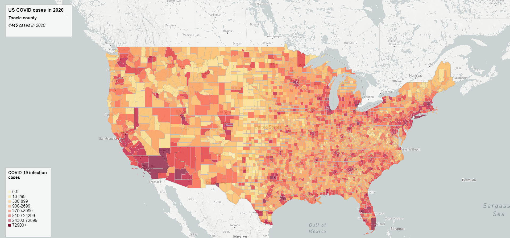
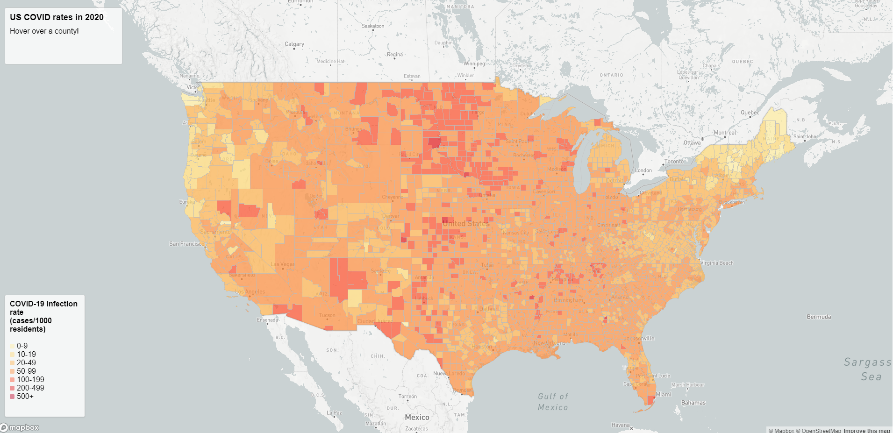

# 2020 COVID-19 maps
During the first year of the pandemic, as much was yet unknown, the full extent of the pandemic had yet to be ralized. With that behind us now, we can have a broad overview of the outcomes that the pandemic has ushered. This project visualizes COVID rates, counts, and deaths by both the state and county level. 

[COVID-19 cases map](https://andrewsang.github.io/2020-COVID-maps/map1.html)

[
COVID-19 rates map](https://andrewsang.github.io/2020-COVID-maps/map2.html)

This project was built using JS/HTML/CSS, along with Mapbox GL. The data was supplied by my professor, and processed using [mapshaper](https://mapshaper.org/). Case and death data originally came from [the NYT](https://github.com/nytimes/covid-19-data/blob/43d32dde2f87bd4dafbb7d23f5d9e878124018b8/live/us-counties.csv), population data came from [the ACS](https://data.census.gov/cedsci/table?g=0100000US.050000&d=ACS%205-Year%20Estimates%20Data%20Profiles&tid=ACSDP5Y2018.DP05&hidePreview=true), both of which originated at the county level. Shapefiles for county boundaries came from the [US Census Bureau](https://www.census.gov/geographies/mapping-files/time-series/geo/carto-boundary-file.html). Code basis from Prof Zhao's lab classwork. 
